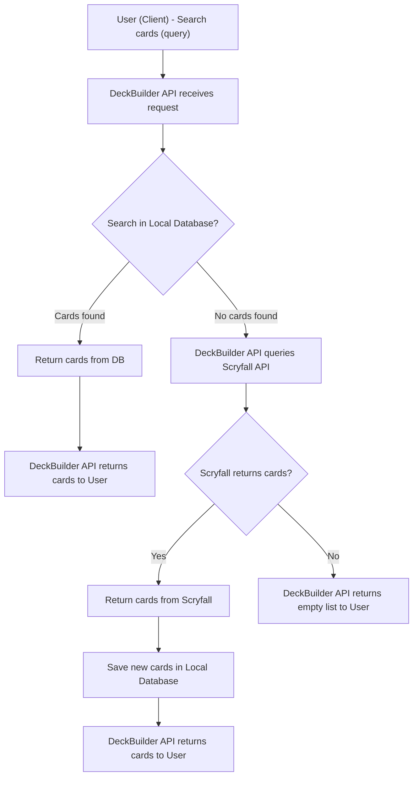

# DeckBuilder API

DeckBuilder API é um serviço para busca, cadastro e gerenciamento de cartas de Magic: The Gathering.  
O sistema permite que os usuários busquem cartas, salvem no banco local e montem decks personalizados.

---

## Funcionalidades

- Buscar cartas por **nome** ou **descrição**.
- Consultar e persistir cartas no banco de dados local.
- Fallback automático para a API do [Scryfall](https://scryfall.com/) quando cartas não estão no banco.

---

## Fluxo de Busca de Cartas

O fluxo de busca da API é ilustrado abaixo:

