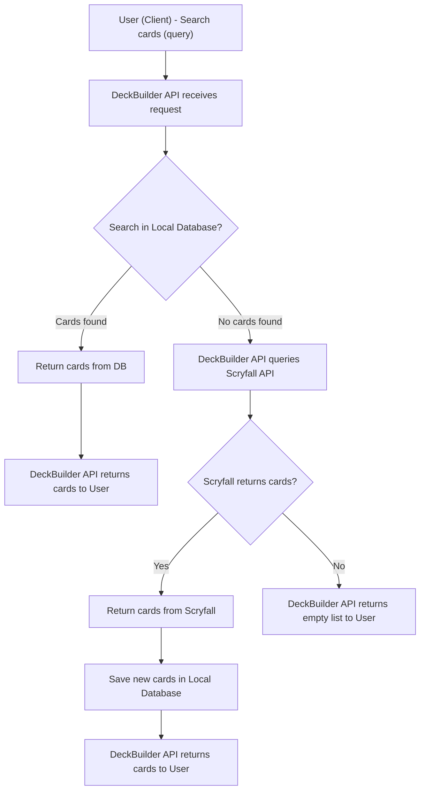

# DeckBuilder API

DeckBuilder API is a service for searching, registering, and managing Magic The Gathering cards.  
The system allows users to search for cards, save them in the local database, and build custom decks.

---
## Features

<strong>Card Search<strong>

- Search cards by **name** or **description**.
- Query and persist cards in the local database.
- Automatic fallback to the [Scryfall](https://scryfall.com/) API when cards are not found locally.

The API's card search flow is illustrated below:

