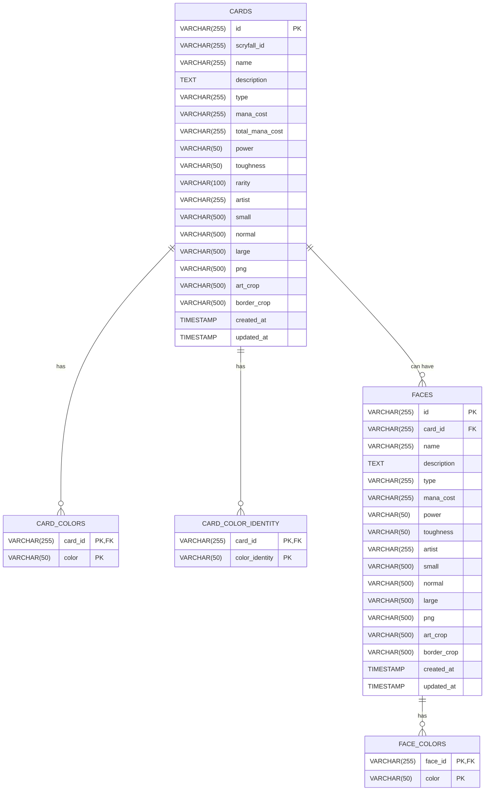

# Database Schema

The database schema stores Magic The Gathering cards, faces, colors, and related data.

## Tables

* **CARDS**: Main table storing card information.
* **CARD_COLORS**: Colors associated with each card.
* **CARD_COLOR_IDENTITY**: Color identity for each card.
* **FACES**: Cards with multiple faces.
* **FACE_COLORS**: Colors associated with each face.

### Relationships

